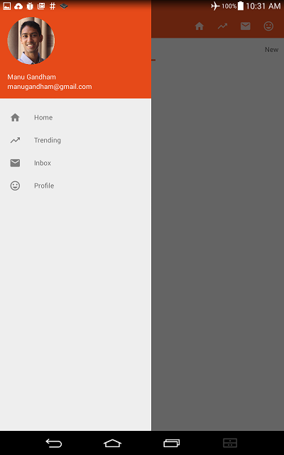
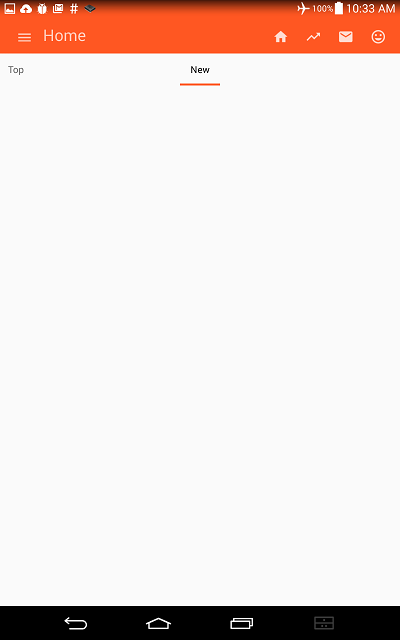
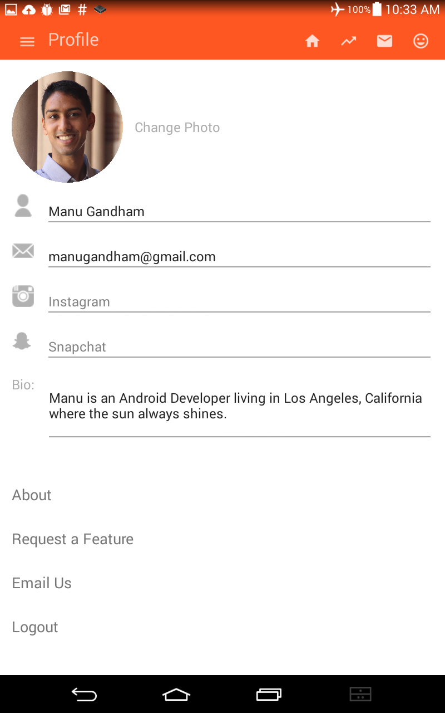

# sample-app

This is an example of Material Design navigation patterns in Android. Users can navigate the app using the swipe-out left side drawer, the icons on the tab bar, and by swiping from the right at any time to access their profile. The app is built using fragments running on a single activity, which enables the application to be lightweight and respond adaptively to different screen sizes and orientations.

Manu Gandham

  
